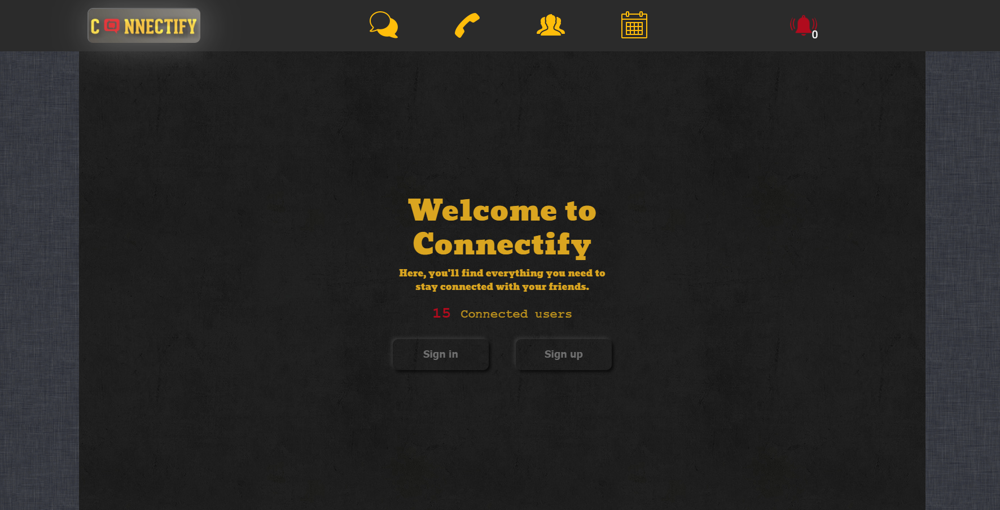
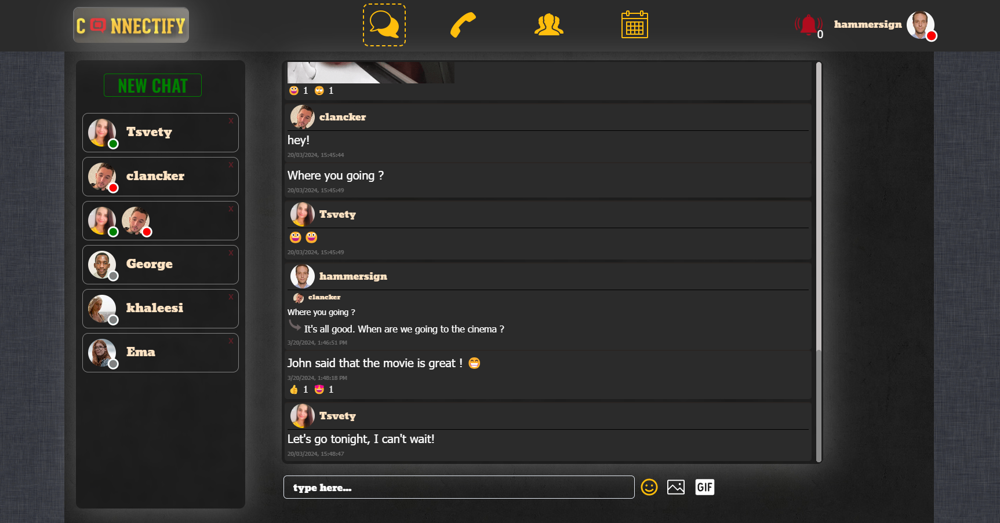
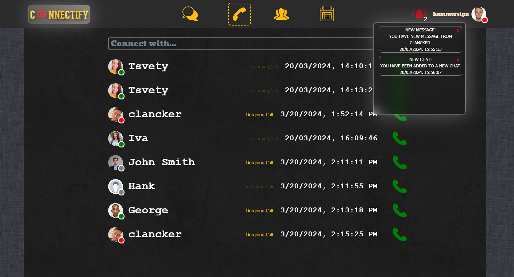
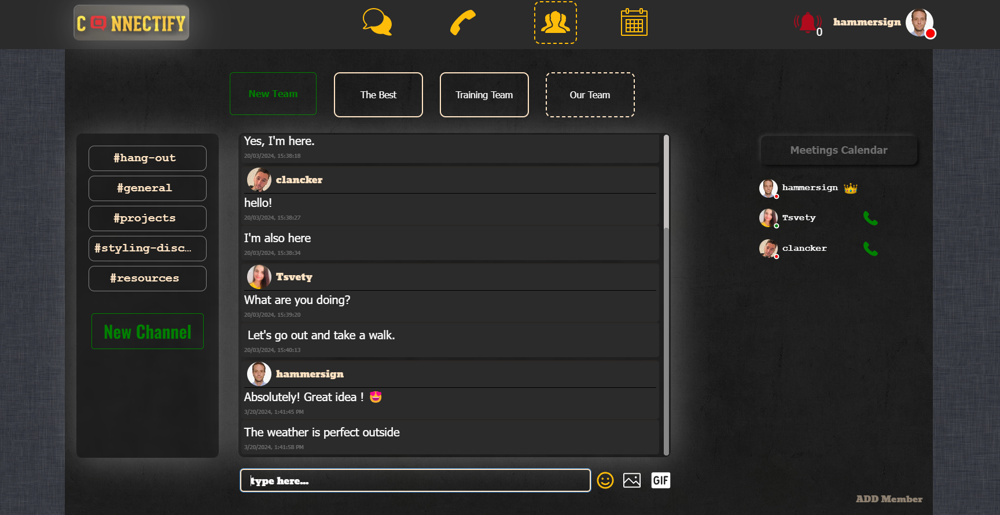
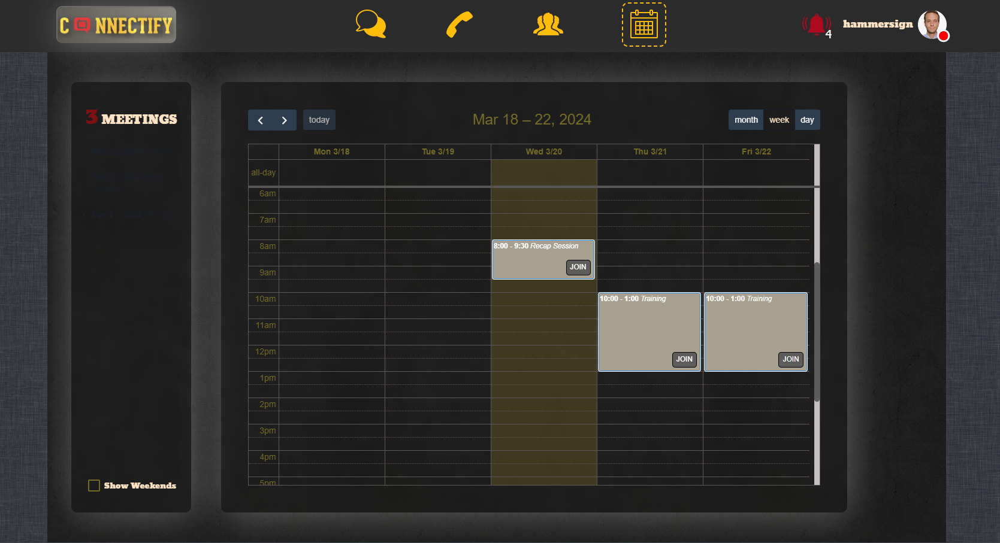
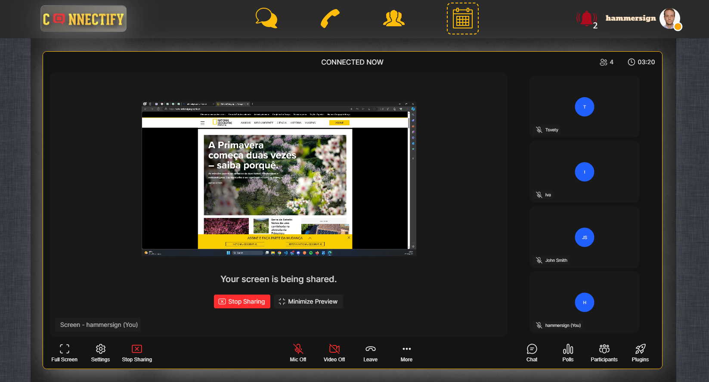

# Connectify


### Description

On our platform you'll find everything you need to stay connected with your friends and loved ones.
From talk about everything to planning hangouts, our platform makes communication easy and fun.
Dive into conversations, express yourself with a wide range of emojis and GIFs, and enjoy the experience of staying in touch with those who matter most.


### Technologies used
- JavaScript
- ReactJS
- HTML
- CSS
- Giphy API
- Dyte SDK
- Firebase
- ESLint
- Git

### Instalation 
1. Install the packages
```
npm install
```
2. Run the application
```
npm start
```

### Usage

## Public part
The Welcome page offers a visually engaging experience. Navigate effortlessly to access our platform by selecting either the 'Sign In' or 'Sign Up' buttons, tailored to your preference and needs.

   
	<br/>

## Private part
  When logged in, the user has access to various features through the navigation bar. This includes access to:
  - Direct messages and group chats . 
  - Team collaboration features.
  - Calendar to schedule and manage events.
  - Notifications with links to corresponding events, in order to stay informed about recent activities and updates.
  -  Users can choose between Do Not Disturb (DND) and Online statuses, automatically transitioning to In a meeting status during calls/meetings and Offline when the user sings out or closes  the tab/browser.
  - Dropdown profile menu with options to change the current status, profile avatar and manage blocked users.

## Direct messages
 - Chat functionality between users or groups, allowing users to send, edit and delete text messages, images and GIFs, as well as, react to them.
 - Users can reply to specific messages.
 - Chat histories can be archived, and users have the option to leave chats.
 - Supports scrolling to older messages for ease of use.
	
	<br/>

## Calls
- History of recent incoming/outgoing calls.
- Searching for a user and starting a direct call.
	
	<br/>
	
## Teams and channels
- Allows the creation of teams and channels with chat functionality, as well as, starting direct calls from here as well.
- Team owners have the ability to schedule team meetings and add new members.
- Team Members have the option to leave teams.
	
	<br/>

## Meetings Calendar
 Connectify meetings facilitate real-time communication and collaboration between team members, allowing remote teams or individuals to connect seamlessly.
 - Meetings can be scheduled in advance.
 - Participants can use the meeting chat feature to share messages during the meeting without interrupting the conversation.
 - Meetings support both video and audio conferencing. Users can turn on or off their cameras and microphones.
	
    <br/>
	

## Developed by

Martin Stefanov, Mehmed Yunuz, Tsvetomila Stoilkova

## License

Telerik Academy